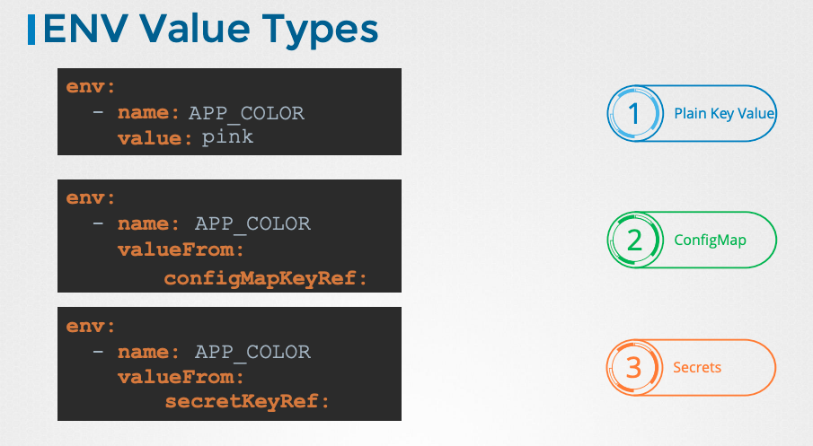
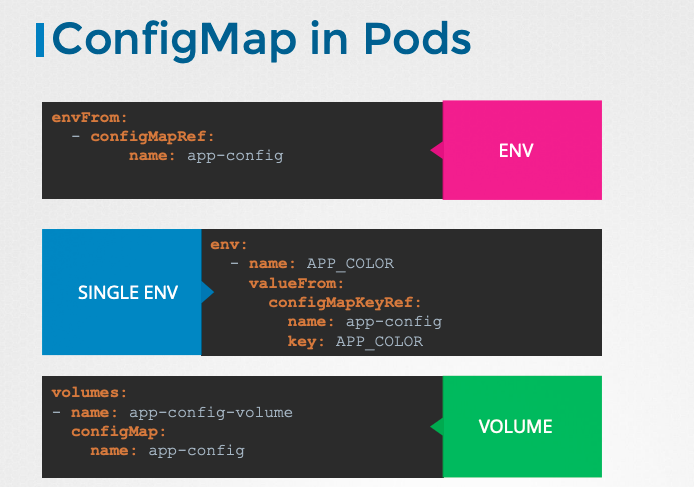

#Application Lifecycle Management

### What is the Metrics Server and how does it works?
The Metrics Server retreives metrics from each of the kuberentes Noeds and Pods, aggregates them and store them in memory.
since each node has a kubelet, the kubelet contains a sub component called cAdvisor(container advisor) and its responsible for retreiving perfromance metrics from pods and exposing them through the kubelet api to be avaialble to Metrics Server  

### What are the types of deployment stratgies?
- Replace (Scale down to 0 then scale up to n replicas)
- rolling updates (default one)(taking a replica down and bring one up, one by one) 

### How does rolling updates works?
it creates a new replica set under the hood and start scaling it, in case of a rollback it start scaling down the newly created replica set while scaling down the original replica set.

### What is the syntax difference between defining enviroment variables as plain key value pairs, config maps, and secrets?

### Why do we need ConfigMaps?
when we have a lot of pod definition files it become dificult to manage all the enviroment data stored in them, thus come ConfigMaps to manage all the enviroment variables centrally.

### What are the ways to inject ConfigMaps in Pods?

### What happens when you inject secrets as volumes?
each attribute in the secret is create as file with the value of the secret as its content

### What is init containers?
When we want a process or task to compeletion in a container, or somekind of pre-setup for our application container. 

### What are the common patterns for designing multi-container PODs?
- side car pattern
- adapter pattern
- ambassador pattern

## Notes
if we want to run a command permenatly everytime an image start we create a Dockerfile and use `CMD` --> we use the `args` field in pod definition 
if we want to pass spcific parameter to whatever command that `CMD` runs, we use `ENTRYRPOINT` instead.
in order to set a default value if we use `ENTRYPOINT` to avoid the image erroring out if parameter weren't specificed we use a combination of `ENTRYPOINT` followed by `CMD`
if we wanna override the program that `ENTRYPOINT` is running we use `--endpoint` with docker run --> we use a the `command` field in a pod definition

###Commands
- `kubectl rollout status deployment/${name-of-deployment}` 
- `kubectl rollout deployment/${name-of-deployment}` 
- `kubectl rollout undo deployment/${name-of-deployment}` --> for rollback 
- `kubectl create secret generic secret-config-name --from-literal=DB_PASS=wohoo`
- `echo -n "text-to-encode" | base64`
- `echo -n "text-to-decode" | base64 --decode `

- kubectl -n elastic-stack  exec -it app cat ./log/app.log
