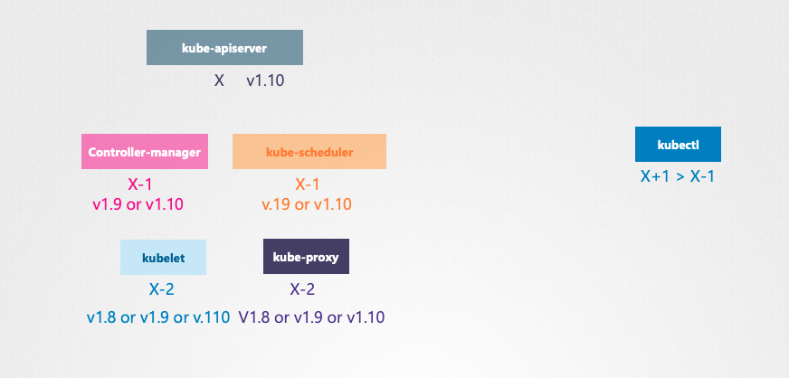
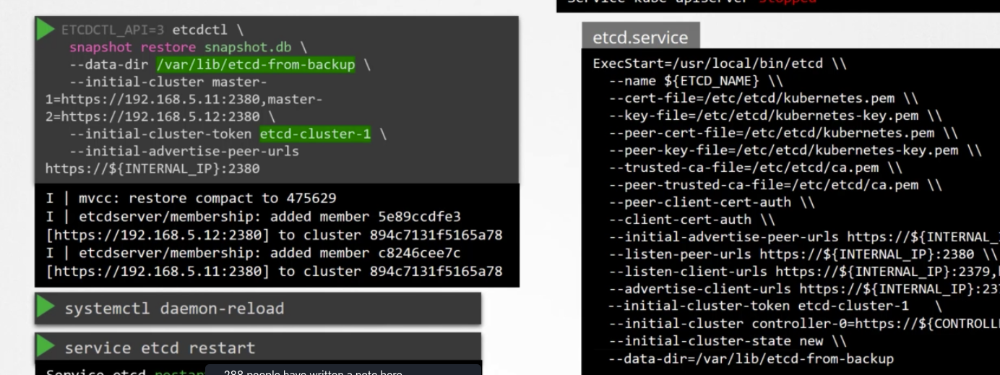

# Cluster Maintenance

### How long does kuberentes wait for a pod to come back online?
Pod evection timeout defaults to 5 mins `kube-controller-manager --pod-evection-timeout=5m0s`.

### How to maintian capacity when taking a node down?
`drain` the node to move workloads to other nodes in the cluster(gracefully terminated and recreated)
then `uncordon` the node so the pods can be scheduled on it once you finish.

### How can you prevent any scheduling on a specifc node?
by cordoning the node `kubectl cordon <node-name>`

### what is the software versoning that kubernetes follows?
Major, Minor Batch v1.11.3
- 1 -> major
- 11 -> minor
- 3 -> patch

### what are the components of the controlplane that has different release cycles and verions?
- ETCD cluster
- CoreDNS

### What is the recommended way to upgrade kubernetes components?
upgrading one minor version at a time.

### What are the possible version differences in the controlplane components?

### What is the way to upgrade a kubernetes cluster deployed using kubeadm?
[Offical documentation](https://v1-20.docs.kubernetes.io/docs/tasks/administer-cluster/kubeadm/kubeadm-upgrade/)
- upgrading kubeadm `apt-get install -y --allow-change-held-packages kubeadm=<new-version>`
- Check for latest version then apply it `kubeadm upgrade plan` -> `kubeadm upgrade apply <new-version>`
- upgrading manually each kubelet on any node  
    - draining if it has workloads `kubectl drain node-1`
    - update the kubeadm on the node repeat step 1
    - upgrading the node `kubeadm upgrade node`    
    - upgrading the kublet `apt-get install -y --allow-change-held-packages kubelet=<version> kubectl=<version>`
    - `sudo systemctl daemon-reload`
    - `systemctl restart kubelet`
    - `kubectl uncordon node01` on Master

### How can we backup ETCD?
- backing up the `--data-dir` that we specified when configuring ETCD
- taking a snapshot from the ETCD database by using the built in `ETCDCTL_API=3 etcdctl \
 snapshot save snapshot.db`

### How to restore an ETCD cluster snapshot?

### what are the mandatory options when using `etcdctl` for a TLS enabled ETCD?
- `--cacert`  --> verify certificates of TLS-enabled secure servers using this CA bundle

- `--cert`    --> identify secure client using this TLS certificate file

- `--endpoints=[127.0.0.1:2379]`   -->       This is the default as ETCD is running on master node and exposed on localhost 2379.

- `--key`        --> identify secure client using this TLS key file

### What happens when we restore ETCD from a snapshot?
it inilaizes a new cluster configuration and configure the memebers of ETCD as new memebers to a new cluster, to prevent a new memeber to join an exisiting cluster.

### How can you backup all resources running on the cluster?
- By quering the kube-api server `kubectl get all -A -o yaml > all-resources.yaml` for a few resource groups.
- Using a tool like Velero to take backups from the cluster using the API.
