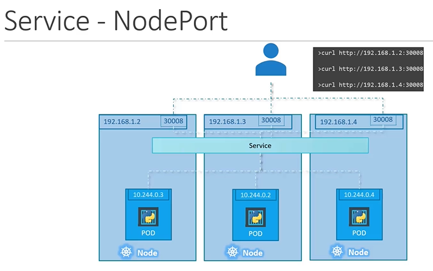

# 🚢 🚢 Cluster Architecture and Core Concepts 🚢 🚢

### What type of servers do we have in kubernetes and what are they responsible for?
- Control Servers (Master Nodes) -> manage, plan, schedule and monitor the cluster and host the kubernetes API(kube-apiserver)
- Worker servers (Worker Nodes) -> host applications as containers

### What are the master nodes (control plane) building blocks?
- Kube-apiserver
- ETCD Cluster (Highly avaiable key->value store)
- kube-scheduler (Identify the right nodes to place the container on)
- Controller Manager
  
### What the worker nodes building blocks?
- kubelet (Listen for instructions from the kube-apiserver and manage containers)
- kube-proxy (Manages the networking and communcation with other nodes)
- Container Runtime Engine aka Docker

### What are the two options of deploying ETCD?
- From scratch by downloading the ETCD binary and configuring it as a service in the master node
- Using Kubeadm by deploying it as a Pod.
- In a HA enviroment we have to make sure that the instances know about each other using `--initial-cluster` param and specifiying the different instances.

### What is the kube-api server?
The Primary managment component in Kubernetes, its at the center of all the different tasks that need to be performed to make a change in cluster such as Authenticating and validating requests, retreving and updating data in ETCD data store, other components like the scheduler, controller manager and kubelet use it to perform updates in the cluser.

### What is the Controller-Manager?
a process that continually monitors the state of various components within the system, and works towards bringing the whole system to the desired functional state.

### What is the Kube-Scheduler?
A process that is responsible for deciding which pod goes on which node, by going throw 2 phases to make a decision,
1- Filter Nodes(e.g. No suffecint CPU or memory)
2- Rank Nodes( calaculating the amount of free recournces that will be avialiable after placing the pod on it)

### What is a Kubelet?
The captain of any worker node, its a process that is responsible for communicating with the master node in order to Register a Node, Create Pods, and Monitor the Node and the PODs on it.

### What is the Kube Proxy?
A process that runs on each node in the cluser, its job is to look for new services and everytime one is created, the proxy create the approriate newtworking rules to forward traffic heading to these services to the actual pods behind them.(e.g. creating an iptable rule to forwad traffic to a service to the Ip of the POD behind it)


### What is a Pod?
The smallest and most basic building block in the kubernetes Model. it consist of one or more containers, storage resources, and a unique IP address in the Kubernetes cluster network.

### How isolating each container in a POD is useful?
As in the long run if you happen to have architectural changes that requires for instance to have one-to-one relationship with another hepling contianer we don't need to manage a map of shared newtworking, volumes etc.. by defualt all that will be handled by the POD since both the application container and the helper container will be in the same enviroment sharing everything.


### What are the required fields in any POD definition yaml file?
- apiVersion
- kind
- metadata
- spec

| Kind       | Version |
| ---------- |:--------|
| POD        | v1      |
| Service    | v1      |
| ReplicaSet | apps/v1 |
| Deployment | apps/v1 |


### How to connect to a service in another namespace, and how is this possible?
${service-name}.${namespace}.svc.cluster.local where
- cluster.local is the default domain name of the kubernetes cluster,
- svc is the subdomain for service
This is possible because when a service is created a DNS entry is added automatically in this format

### How to switch from the defualt namespace to another one permenatly?
`kubectl config set-context $(kubectl congig current-context) --namespace=${desired-namespace}`

### How can we Limit resouces in a namespace?
By creating a Resource Quota e.g. 
```
apiVersion: v1
kind: ResourceQuota
metadata:
  name: compute-quota
  namespace: dev

spec:
  hard:
    pods: "10"
    requests.cpu:"4"
    limits.cpu: "10"
    limits.memory: 10Gi
```

### What are services and what do they do?
Enable connectivity establishment between pods and external datasources or hosts
Enable loose coupling between microservices in our application 

### What are the service types available in kubernetes?
   
1. NodePort
    - Where the service makes an internal POD accessible on a port on the NODE.
   

1. ClusterIP
    - the service creates a **`Virtual IP`** inside the cluster to enable communication between different services such as a set of frontend servers to a set of backend servers.
    
1. LoadBalancer
    - Where the service provisions a **`loadbalancer`** for our application in supported cloud providers.
    
    
### How does service loadbalancing works?
it already finds all the pods that match the same label we provide and begin load balancing automatically using a random algorithm

### How does a nodeport service works with multiple pods on multiple nodes?
Kubernetes creates a service that spans all the nodes in the cluster and maps the target port to the same node port in the cluster, this way we can access the application using any node ip in the cluster and the same port



### How can you view options for any process running in a cluster?
- if deployed using `kubeadm` `cat /etc/kuberentes/manifests/${process}.yaml`
- if deployed as a service `cat /etc/systemd/system/${process}.service`

### How can you scale your replicaset?
- Using `kubectl replace -f replicaset-definition.yaml`
- `kubectl scale --replicas=6 -f replicaset-definition.yaml`
- `kubectl scale --replicas=6 replicaset name-of-replicaset

### What are Deployments in Kuberenetes?
An abstraction on top of Replicasets that provide us with the capability to upgrade the underlying instances seamlessly using rolling updates, undo changes, and pause and resume changes as required

### What is the valid range for NodePorts?
from 30,000 to 32,767

### What happends when we don't specify any of the ports of the service?
If a `targetPort` is not provided it is assumed to be the same as `port`
If a `nodePort` is not provided it is automatically allocated within the valid range

### What happens when you create a `LoadBalancer` service in an unsupported environmnet?
It will act as nodePort service 

### How can you create a Service named redis-service of type ClusterIP to expose pod redis on port 6379?
`kubectl expose pod redis --port=6379 --name redis-service --dry-run=client -o yaml`

### How to create a `pod` and a `ClusterIP` service with one command?
`kubectl run --image=image-name pod-name --port=8080 --expose`

### How does the apply command work internally?
It converts the yaml local file to json object and stores it the `annotations` of the live object as the `last applied configuration` [documentation](https://kubernetes.io/docs/tasks/manage-kubernetes-objects/declarative-config/#merging-changes-to-primitive-fields)
