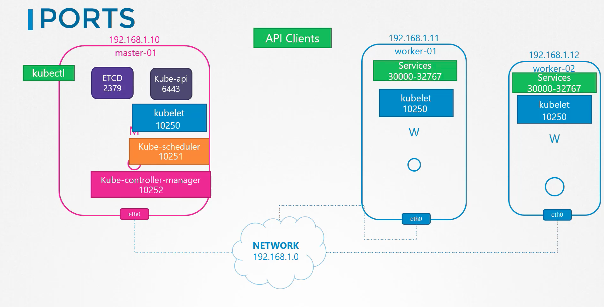

# Networking

### How do we connect computers together on single network?
We use a switch and a network interface on each computer and assign that network interface an IP address from the switch's network.

### How do we connect multiple computers on different networks?
- We use a router and connect it to each network
- Configure a gateway on each network with the router as it's destination(so if the IP the computer trying to hit is not on the network, it knows where it should go) `ip route add <other-network-cidr> via <router-address>`

### What is the default configuration of IP forwarding on linux?
By default in linux packets are not forwareded from one interface to the next for security reasons, e.g., if we had eth0 connected to a private network and eth1 connected to a public network, we don't want anyone from the public network to be able to easily send messages to a private network unless we explicitly allow that. 

### What command is used to list and modify networking interfaces on the host?
`ip link`

### What command is used to see and set the ip addresses to network interfaces?
`ip addr` & `ip addr add 192.168.1.10/24 dev eth0` -> only valid until a restart to set them permenantly must modify `/etc/networkinterfaces`

### What command is used to view and add route in routing tables?
`ip route` or `route`  & `ip route add <network-cidr> via <destination-ip>` 

### How to check if Ip forwarding is enabled on a host?
checking the value of `/proc/sys/net/ipv4/ip_forward`
`echo ` > `/proc/sys/net/ipv4/ip_forward`
and to persist the changes across reboots we set the value in `/etc/sysctl.conf` -> `net.ipv4.ip_forward = 1` 

### How to add a name for a specific ip and what is it called?
Name Resloution
by adding an entry in the `/etc/hots` file -> `192.168.1.11     db`

### How to add a DNS server on your host?
by adding an entry to the `/etc/resolv.conf` 
`nameserver     192.168.1.100`

### What tool can we use to query a hostname from a dns server?
- `nslookup google.com` doesn't consider the entries in your `/etc/hosts` file only in DNS server
- `dig google.com`

### what is the analogy between a host and a namespace?
A host is like a house and namespace is like an isolated room inside that house

### What command can we use to list and create namespaces?
`ip netns` &  `ip netns add vr-space`

### How can we execute a command inside a namespace?
Running command `ip link` inside the name space -> `ip netns exec vr-space ip link` | `ip -n vr-space link`

### How to connect two namespaces?
- Create a virtual cable | pipe with two ends -> `ip link add veth-red type veth peer name veth-blue`
- Attach each end of the virtual cable to each namespace -> 
  - `ip link set veth-red netns red`
  - `ip link set veth-blue netns blue`
- Assign IPs to each end of the cable
  - `ip -n red addr add 192.168.15.1 dev veth-red`
  - `ip -n blue addr add 192.168.15.2 dev veth-blue`
- Bring up the interfaces
`ip -n red link set veth-red up`
`ip -n blue link set veth-blue up`
~[linking-namespaces](./images/linking-ns.png)

### How to connect multiple namespaces together?
By creating a virtual switch and a virtual cable for each namespace with one end of the cable for the namespace and the other for the switch(Linux Bridge)
- We create a cable `ip link add veth-red type veth peer name veth-red-br`
- We connect both ends of the cable one to the namespace and another to the switch for each namespace
`ip link set veth-red netns red`
`ip link set veth-red-br master v-net-0`
`ip link set veth-blue netns blue`
`ip link set veth-blue-br master v-net-0`
- Set ip addresses for each cable end and bring them up
`ip -n red addr add 192.168.15.1 dev veth-red`
`ip -n blue addr add 192.168.15.2 dev veth-blue`
`ip -n red link set veth-red up`
`ip -n blue link set veth-blue up`

### What is the bridge network virtual switch?
Just another network interface on the host.
### How to connect the namespaces network to the host machine?
By assiging an IP address to the namespaces network switch as for the host machine its just another network interface 
`ip addr add 192.168.15.5/24 dev v-net-0`

### What are the types of networks you can configure your workloads with on Docker?
- None network -> tottaly isolated
- Host network -> exposed to a specific port on the host(can't use the same port twice)
- Bridge network -> internal private network is created where containers and the host gets attached to it.

### What does Docker uses to perform port mapping?
Create a NAT rule using iptables, creating an entry in the NAT table to append the rules to the prerouting chain to change destination port from x to y.
### What docker does once installed on a host?
It creates a internal private netowrk called `bridge` in docker and `docker0` on the host

### What is the networking steps to create a bridge network?
- Create a network Namespace
- Create Bridge Network/interface
- Create vEth Pairs(Pipe, Virtual Cable) 
- Attach vEth to namespace
- Attach other vEth to the Bridge
- Assign IP Addresses
- Bring the interfaces up
- Enable NAT - IP Masquerade

### What is a Container network interface?
A set of standards that define how programs should be developed to solve networking challenges in a container runtime environment.

### What are the CNI rules that every container runtime must have?
- Container runtime must create network namespace
- Identify network the container must attach to
- Container runtime must invoke Network Plugin(Bridge) when container is ADDed
- Container runtime must invoke Network Plugin(Bridge) when container is Deleted
- Json Format of the network configuration

### What are the CNI rules that every plugin must have?
- Must support command line arguments ADD/DEL/CHECK
- Must support parameters container id, network ns etc..
- Must manage IP Address assignment to PODs
- Must return results in a specific format

### What are the ports that should be open on Master and Worker nodes?
- Master
  - api-server -> `6443`
  - etcd -> `2379`
  - etcd clients -> `2380`
  - kubelet -> `10250`
  - kube-scheduler -> `10251`
  - kube-controller-manager -> `10252`
- Worker
  - Services -> `30000-32767`
  - Kubelet -> `10250`
### How does Kubernetes handles Docker Incompatiabilty with CNI?
It creates container with no networking at all, then invoke the CNI plugin with the right parameters

### What are the ports that should be open for each component in the cluster?

### What is the Kubernetes networking model for Pods?
- Every POD should have an IP address.
- Every POD should be able to communicate with every other POD in the same node.
- Every POD should be able to communicate with every other POD on other nodes without NAT.

### 
