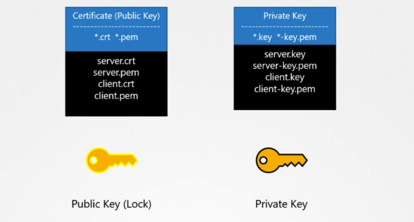
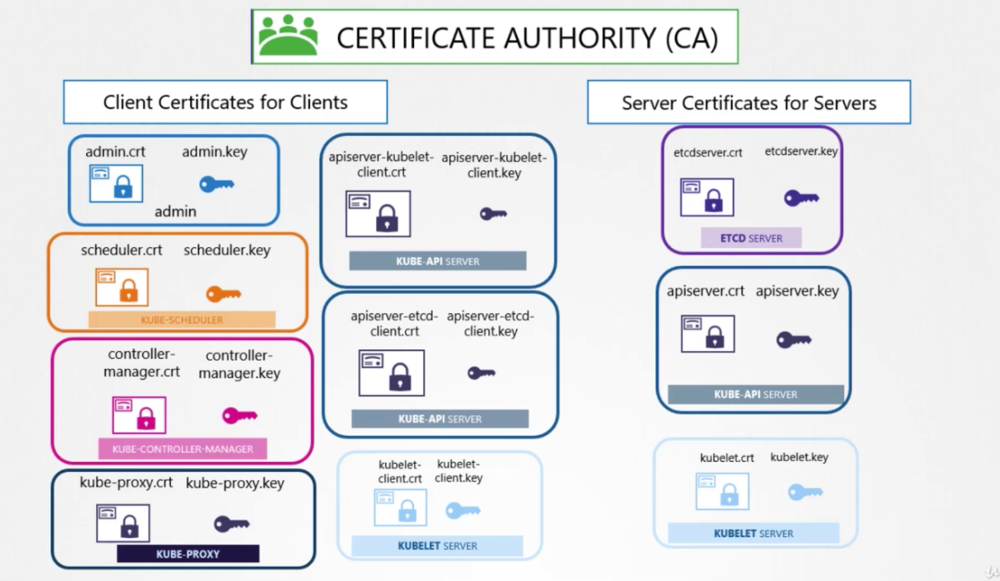
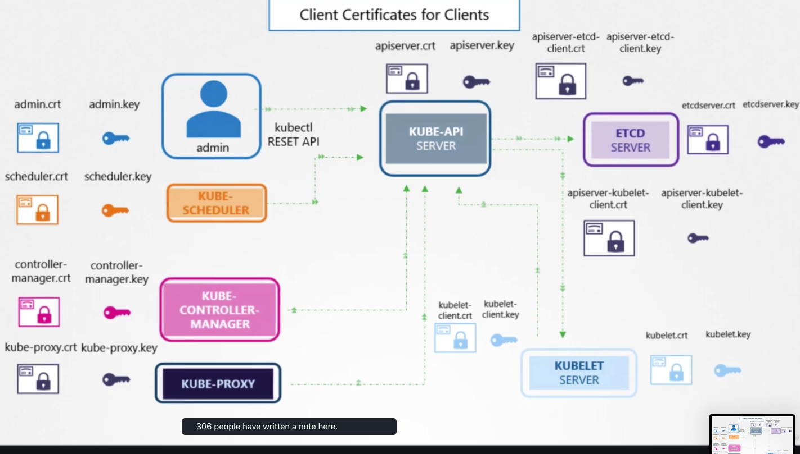
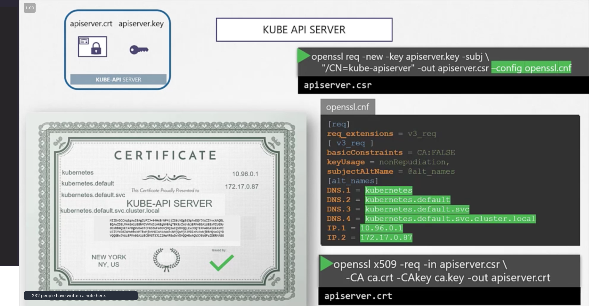
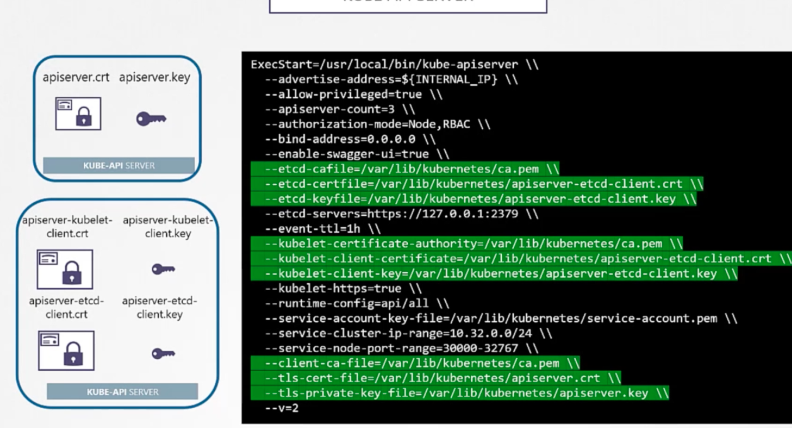
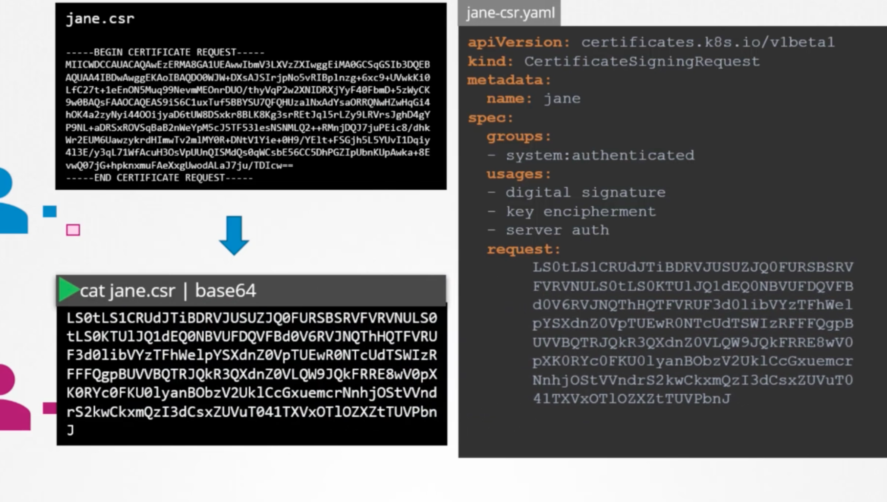
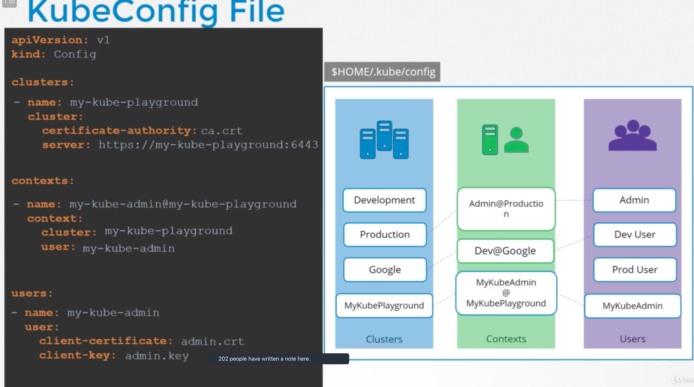
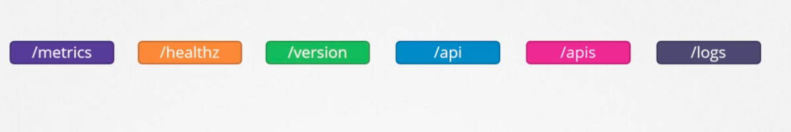
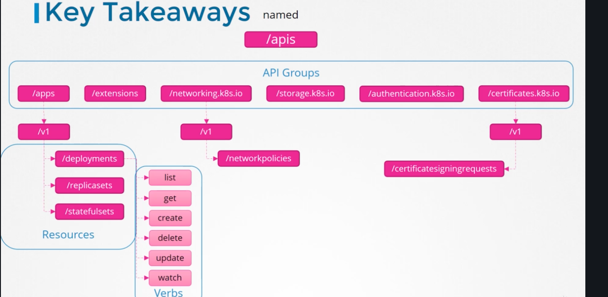

# Security

### What are the Authentication mechanisms for admins and developers accessing the kube-apiserver?
- Username and Password in a Static Password File(Deprecated 1.19)
- Username and Token in a Static Token File
- Certificates
- 3rd party authentication protocols `Identity Services` such as LDAP

<!-- Deprecated
### How can we configure username and password or token authentication?
by creating a `.csv` file that has the format `password/token,username,userid,optionalGroupName` and pass the file as an option to the kube-apiserver `--base-auth-file` -->

### What are the steps to authenticate using Asymetric encryption?
1) Server generates a pulic and private key pair `openssl genrsa -out my-website.key 1024`, `openssl rsa -in my-website.key -pubout > my-website.pem`
2) Server send a certificate signing request to a CA with its public key
3) The CA Encyrpt the server public key with its private key
4) Server sent signed public key to the client
6) Client decrypt the signed public key with the CA public key( The Server is who they say they are)
7) Client Securly transfer the symmetric key by encrypting it using the public key from the server 
9) The server decrypt the symmetric key sent by the client using the private key
10) The symmetric key used for any data sent or received by the two entities

### What are the naming conventions for private and public keys?

### What are the type of certificates that the cluster needs?

### How to generate  the certificate for the Kubernetes Certificate Authority?
- Generate a private key -> `openssl genrsa -out ca.key 2048`
- Generate a Certificate Signing Request -> `openssl req -new -key ca.key -subj "/CN=KUBERNETES-CA" -out ca.csr`
- Sign the Certificate -> `openssl x509 -req -in ca.csr -signkey ca.key -out ca.crt` 

### How to generate the certificates for the admin user?
- Generate a private key `openssl genrsa --out admin.key  2048`
- Generate a  CSR and adding it to the admin group`SYSTEM:MASTERS`  -> `openssl req -new -key admin.key -subj "/CN=kube-admin/O=system:masters" -out admin.csr`
- Sign the Certificate -> `openssl x509 -req -in admin.csr -CA ca.crt -CAkey ca.key -out admin.crt`

### What should we take in consideration when we are creating certificates for system components?
the name inside the certificate must be prefixed with `system` e.g. `SYSTEM.KUBE-SCHEDULER`

### How do you differenciate the admin User from any other user?
By assigning it to the admins group `SYSTEM:MASTERS`

### Where should we specifiy the other kube-apiserver alternate names?
by creating an OpenSSL config file and passing it as an option when creating the certificate signing request

### What certificates should be considered that that the apiserver will need when communicating as a client?
we pass these certificates to the kube-apiserver service configuration file
- etcd certificates 
- kubelet certificates

### What is the naming convention for each kublet nodes as clients and as servers?
As server -> named after there node name.
As clients -> system:node:node-name and added to a group called `SYSTEM:NODES`

### How to manage the CA signing and rotating requests and automate it?
Using the Certificates API in the control manager by generating `CertificateSigningRequest` definition file

### where does the kubectl look for the config file by default?
$HOME/.kube/config  

### What does the kubeconfing file structure consist of?

### How is the kuberentes API structured?
APIs are splitted across groups on the top level we have

all new apis are published under `named /apis`

### What are the authorization methods supported by kubernetes?
- node 
- ABAC Attribute based
- RBAC Role Based
- Webhook 
- AlwaysAllow
- AlwaysDeny

### What is Node Authorization or Authorizer?
Managing Access within the Cluster such as the interaction between the kubelet and the Kube API server, it uses a `Node Authorizer`
to check for any request coming from a user prefixed with the name `system:node` and part of the `SYSTEM:NODES` group is authorized by the Node Authorizer

### what is ABAC?
'Like inline policies' Attribute based authorization for External access to the api. Defining a user or a group of users with a set of permessions

### What is RBAC?
Instead of associating a user with a set of permissions, we define a Role and RoleBinding

### What is Webhook authorization?
Outsourcing the authorization to a third party like `open policy agent`

### How authorization works?
By setting the `--authorization-mode` option on the kube-apiserver service and request goes through the authorization methods one by one.

### How can you check specific access rights?
`kubectl auth can-i delete nodes --as developer`

### What are the steps that you should take to debug certificates related issue in a cluster?
- Figure out how the cluster was deployed Kubeadm or the hard way.
- take each system component and start identifiying all the certificates being used
  - Component
  - Type(Server | Cient)
  - Certificate Path
  - CN Name
  - ALT Names
  - Organization
  - Issuer
- Run the x509 to decode and view the certificate`openssl x509 -in /etc/kubernetes/pki/apiserver.crt -text -noout`
- Start looking at logs `journalctl -u etcd.service -1`
- In case the components are down go one level down to view the containers `docker ps -a` -> `docker logs container-id`
