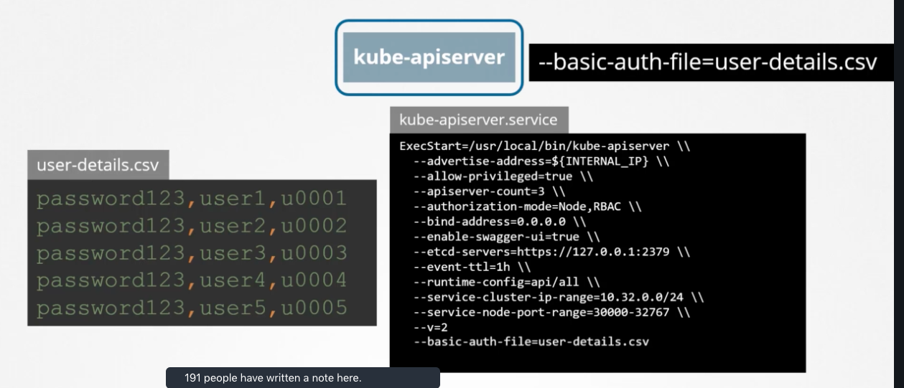

#Security

### What are the Authentication mechanisms for admins and developers accessing the kube-apiserver?
- Username and Password in a Static Password File
- Username and Token in a Static Token File
- Certificates
- 3rd party authentication protocols `Identity Services` such as LDAP

### How can we configure username and password or token authentication?
by creating a `.csv` file that has the format `password/token,username,userid,optionalGroupName` and configure the kube-apiserver with it using `--base-auth-file`

### What are the naming conventions for private and public keys?

### What are the type of certificates that the cluster needs?

