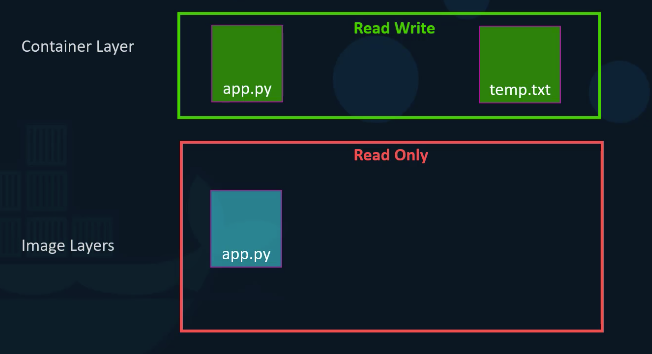
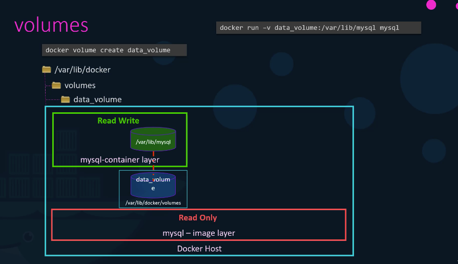
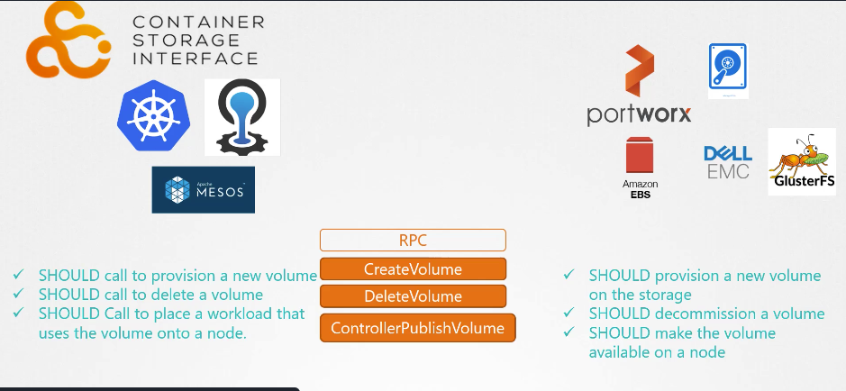

# Storage

### Where does docker store data once its installed?
Under `/var/lib/docker` and create 4 folder `aufs, container, images, volumes`

### How does docker store the files of an image or a container?
Layered Architecture, each line of instruction create a new layer with just the changes of the previous layer.

### What is the copy on write mechanism in docker?
As the image layers are read only, upon trying to write to any of its files docker makes a new copy to the container layer.

### What are the types of mounting and explain both of them?
Volume Mounting -> which is binding a directory inside docker container to the default docker volumes directory under `/var/lib/docker/volumes`
Bind Mounting -> which is binding a directory inside docker to a directory at any location on the docker host.

### How does volume mounting works in Docker?
Docker create a new directory under `/var/lib/docker/volumes` with the volume name, upon running the container docker mounts the volume to the target directory inside the container layer so all data written in that file is in fact saved at the volume.

### what is the new and prefered way to mount volumes in docker?
using `--mount`, e.g., `docker run --mount type=bind,source=/my-project/database,target=/var/lib/mysql  mysql`

### What does Docker uses to enable and manage its layered architecture?
Storage Drivers such as `AUFS`,`ZFS`, `BTRFS`, `Overlay`, `Overlay2`, `Device Mapper`

### How does Docker handle and manages volumes?
Volume Drivers plugins such as `Local`, `Azure File Storage`, `Convoy`, `Digital Ocean Block Storage`, `Flocker`, `gce-docker`, `GlusterFS`, `NetApp`, `RexRay`, `Portworx`, `VMware vSphere Storage`.

### What is a CRI?
A standard that define how an orchestration soultion like (kubernetes, CloudFoundry, and Mesos)  will communicate with a container runtimes like docker or rocket

### What is CSI?
a universal standard that make any container orchestration tool work with any storage vendor with a supported plugin. write your own drivers for your own storage.

### Why it's not recommended to uses hostPath on multiple nodes?
Because the pods will write to the volume directory on their respectative node and expect all of those direcotries to be the same but since they are on different servers they are infact not the same.
Instead we should be using an external replicated cluster storage solution.

### What is the difference between volumes and persisten volumes?
We define volumes in pod definition files
Persistent volumes is a cluster wide pool of storage volumes that each pod can carve out a piece of it using PVC.

### What are the Access Modes for persisten volumes?
- ReadOnlyMany
- ReadWriteOnce
- ReadWriteMany

### What is the relationship between PV and PVC?
One to One relationship, so no other claims can utilize the capcity of the volume even if not all of it is utilized.

### What happens to the underline PV if the claim is deleted?
Depends on the value of option `persistentVolumeReclaimPolicy` it can be one of the following
- Retain(Remains until manually deleted and not available to use by any other claims)
- Delete
- Recycle(Data will be scrubbed before making it available again)

### What are storage classes?
Dynamically provisioning storage for PVCs.
Storage classes uses the defined provisoer to provision the storage, create a PV, then bind hte PVC to that PV.

